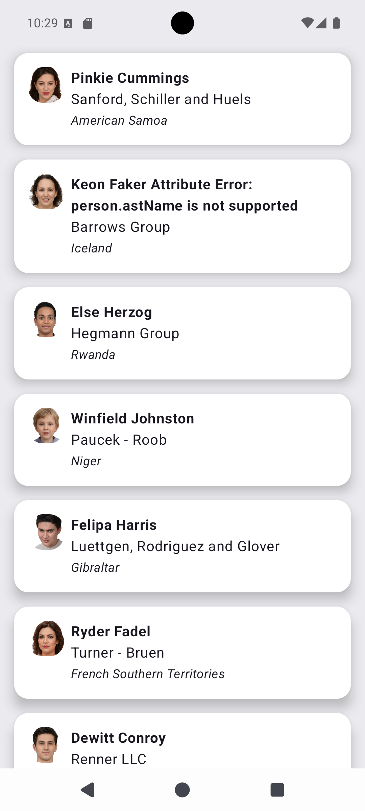
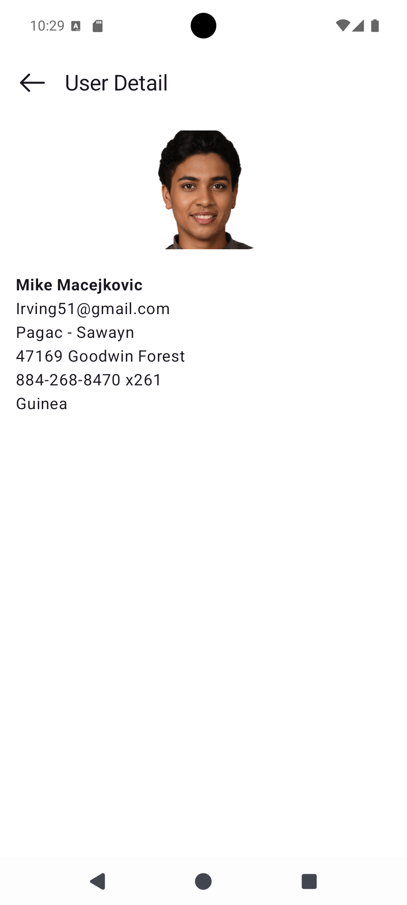

# UserList — Android Assignment

Android application that fetches and displays a list of users from a remote REST API, with a drill-down detail screen. Built with **MVVM + Clean Architecture** across a **multi-module Gradle** project.

---

## 📸 Screenshots & Demo

|                   User List Screen                   |                   User Detail Screen                   |
|:----------------------------------------------------:|:------------------------------------------------------:|
|  |  |

**Demo Recording**
> <video src="media/video.webm" controls="controls" style="max-width: 100%;" />

---

## 🏗️ Architecture

The project follows **MVVM + Clean Architecture** with clear separation of concerns enforced at the **Gradle module boundary** level. The dependency rule flows strictly inward — outer layers depend on inner ones, never the reverse.

```
                        ┌─────────────────────────────┐
                        │            :app              │
                        │   MainActivity · NavGraph    │
                        └──────────────┬──────────────┘
                                       │
              ┌────────────────────────▼──────────────────────────┐
              │          :feature:users:presentation               │
              │  UserListScreen · UserDetailScreen                 │
              │  UserListViewModel · UserDetailViewModel           │
              │  UserListRoute · UserDetailRoute                   │
              └────────────────────────┬──────────────────────────┘
                                       │ depends on
              ┌────────────────────────▼──────────────────────────┐
              │           :feature:users:domain                    │
              │  User (model) · UserRepository (interface)         │
              │  GetUserListUseCase · GetUserDetailUseCase         │
              └──────┬─────────────────────────────────┬──────────┘
                     │ implemented by                   │ depends on
      ┌──────────────▼──────────────┐    ┌─────────────▼────────────┐
      │  :feature:users:data        │    │      :core:common        │
      │  DefaultUserRepository      │    │   Result<T> sealed class │
      │  UserApiService · UserDto   │    └──────────────────────────┘
      │  UserMapper · DI Modules    │
      └──────────────┬──────────────┘
                     │ depends on
      ┌──────────────▼──────────────┐
      │       :core:network         │
      │  NetworkModule · OkHttp     │
      │  Retrofit · safeApiCall()   │
      │  NetworkInterceptor         │
      └─────────────────────────────┘
```

### Module Responsibilities

| Module | Layer | Responsibility |
|---|---|---|
| `:app` | Application | `MainActivity`, `UserApplication` (@HiltAndroidApp), `UserAppNavGraph` |
| `:feature:users:presentation` | Presentation | Compose screens, ViewModels, UiState, UiEvents, type-safe navigation routes |
| `:feature:users:domain` | Domain | `User` domain model, `UserRepository` interface, `GetUserListUseCase`, `GetUserDetailUseCase` |
| `:feature:users:data` | Data | `DefaultUserRepository`, `UserDto`, `UserMapper`, Hilt DI modules |
| `:core:network` | Core | Retrofit & OkHttp setup, `NetworkModule`, `NetworkInterceptor`, `safeApiCall` extension |
| `:core:common` | Core | `Result<T>` sealed class shared across all layers |
| `:core:designsystem` | Core | Material3 colour scheme, typography, `UserListTheme` |

### Dependency Rule at a Glance

```
:feature:users:presentation  →  :feature:users:domain  ←  :feature:users:data
                                         ↓
                                    :core:common
                                         ↑
                                   :core:network
```

`:feature:users:presentation` **never** directly references `:feature:users:data`. The concrete `DefaultUserRepository` is wired at runtime by Hilt inside `:app`, keeping the domain layer free of implementation details.

---

## 🛠️ Tech Stack

| Technology | Version | Purpose |
|---|---|---|
| **Kotlin** | 2.3.20 | Primary language |
| **Jetpack Compose** | BOM 2026.03.01 | Declarative UI |
| **Material3** | (via Compose BOM) | Design system components and theming |
| **Hilt** | 2.59.2 | Compile-time safe dependency injection |
| **KSP** | 2.0.20-1.0.25 | Annotation processing for Hilt (replaces KAPT) |
| **Retrofit** | 3.0.0 | Type-safe HTTP client |
| **OkHttp** | 5.3.2 | HTTP engine with logging interceptor |
| **kotlinx.serialization** | 1.11.0 | JSON serialisation for network DTOs |
| **Coroutines** | (with Kotlin 2.3.20) | Async/concurrent operations via `viewModelScope` |
| **Navigation Compose** | (via Compose BOM) | Type-safe Compose Navigation with `@Serializable` routes |
| **Hilt Navigation Compose** | 1.3.0 | `hiltViewModel()` integration for Compose destinations |
| **Coil** | 2.7.0 | Async image loading for user profile photos |
| **kotlinx-collections-immutable** | 0.4.0 | `ImmutableList` / `PersistentList` for stable Compose UiState |
| **JUnit 4** | 4.13.2 | Unit test runner |
| **Mockito-Kotlin** | 6.3.0 | Mocking for unit tests |
| **kotlinx-coroutines-test** | 1.10.2 | `runTest`, `TestDispatcher`, coroutine test utilities |
| **AGP** | 9.1.1 | Android Gradle Plugin |

---

## 📁 Project Structure

```
UserList/
├── app/
│   └── src/main/
│       ├── UserApplication.kt          # @HiltAndroidApp
│       ├── MainActivity.kt             # @AndroidEntryPoint, sets Compose content
│       └── navgraph/
│           └── UserAppNavGraph.kt      # Root NavHost wiring list ↔ detail
│
├── core/
│   ├── common/
│   │   └── result/Result.kt            # sealed class Result<T>: Success | Error
│   ├── designsystem/
│   │   └── theme/
│   │       ├── Color.kt                # Brand colour tokens
│   │       ├── Theme.kt                # UserListTheme composable
│   │       └── Type.kt                 # Typography scale
│   └── network/
│       ├── di/NetworkModule.kt         # Hilt: Retrofit, OkHttp, ConverterFactory
│       ├── extension/ResponseExtension.kt  # safeApiCall() wrapper
│       └── interceptor/NetworkInterceptor.kt  # Content-Type header interceptor
│
└── feature/users/
    ├── domain/
    │   ├── model/User.kt               # Domain model (no Android/framework deps)
    │   ├── repository/UserRepository.kt  # Interface — contract for data layer
    │   └── usecase/
    │       ├── GetUserListUseCase.kt   # Fetches full user list
    │       └── GetUserDetailUseCase.kt # Fetches single user by ID
    │
    ├── data/
    │   ├── datasource/remote/UserApiService.kt  # Retrofit interface
    │   ├── di/
    │   │   ├── UserApiServiceModule.kt # Provides UserApiService
    │   │   └── UserRepositoryModule.kt # Binds DefaultUserRepository → UserRepository
    │   ├── mapper/UserMapper.kt        # UserDto.toDomain() extension
    │   ├── model/UserDto.kt            # @Serializable network DTO
    │   └── repository/DefaultUserRepository.kt  # Implements UserRepository
    │
    └── presentation/
        ├── route/
        │   ├── UserListRoute.kt        # @Serializable route + NavGraphBuilder ext
        │   └── UserDetailRoute.kt      # @Serializable route + NavGraphBuilder ext
        └── ui/
            ├── userlist/
            │   ├── UserListScreen.kt   # Compose list UI
            │   └── UserListViewModel.kt  # StateFlow<UiState> + SharedFlow<UiEvent>
            └── detail/
                ├── UserDetailScreen.kt # Compose detail UI
                └── UserDetailViewModel.kt  # Loads user by ID from SavedStateHandle
```

---

## 🔑 Key Design Decisions

### 1. Type-safe Navigation
Routes are `@Serializable` Kotlin data classes/objects, enabling compile-time safe navigation argument passing with no string-based route keys:

```kotlin
@Serializable
data class UserDetailRoute(val userId: Int)

// Navigate:
navController.navigate(UserDetailRoute(userId = user.id))

// Retrieve in ViewModel:
val userId = savedStateHandle.toRoute<UserDetailRoute>().userId
```

### 2. Stable UiState with ImmutableList
`List<T>` in Kotlin is an interface — the Compose compiler cannot verify it is immutable and marks containing UiState classes as **unstable**, causing unnecessary recompositions. `ImmutableList` from `kotlinx-collections-immutable` solves this:

```kotlin
data class UserListUiState(
    val loading: Boolean = true,
    val users: ImmutableList<User> = persistentListOf()
)
```

### 3. One-time Events via SharedFlow
Error messages and navigation events are decoupled from state using `MutableSharedFlow`, preventing events from re-delivering on recomposition:

```kotlin
private val _uiEvent = MutableSharedFlow<UserListUiEvent>()
val uiEvent = _uiEvent.asSharedFlow()
```

### 4. safeApiCall Wrapper
A single extension function centralises all HTTP error handling, avoiding repetitive try/catch blocks in every repository call:

```kotlin
suspend fun <T, R> safeApiCall(
    apiCall: suspend () -> Response<T>,
    transform: (T) -> R
): Result<R>
```

---

## 🧪 Unit Tests

Tests are co-located with each module under `src/test/`.

| Test Class | Module | Coverage |
|---|---|---|
| `GetUserListUseCaseTest` | `:feature:users:domain` | Returns `Result.Success` from repository; propagates `Result.Error` |
| `GetUserDetailUseCaseTest` | `:feature:users:domain` | Passes `userId` correctly; success and error propagation |
| `UserListViewModelTest` | `:feature:users:presentation` | Loading state on init; `UiState.users` populated on success; empty list on error |

All tests use **Mockito-Kotlin** for mocking, **kotlinx-coroutines-test** with `UnconfinedTestDispatcher` via a `MainDispatcherRule`, and `runTest` for coroutine-safe assertions.

Run all unit tests:

```bash
./gradlew test
```

Run per-module:

```bash
./gradlew :feature:users:domain:test
./gradlew :feature:users:presentation:test
```

---

## 🚀 Getting Started

### Prerequisites

| Tool | Required Version |
|---|---|
| Android Studio | Meerkat (2024.3.1) or later |
| JDK | 11 |
| Android SDK | API 36 |
| minSdk | 24 (Android 7.0) |

### Build & Run

```bash
# Clone the repo
git clone https://github.com/abhishekjain1586/UserList.git
cd UserList

# Run on a connected device or emulator
./gradlew :app:installDebug
```

### API Endpoint

```
GET https://fake-json-api.mock.beeceptor.com/users
GET https://fake-json-api.mock.beeceptor.com/users/{id}
```

The app handles all four states explicitly:

| State | Behaviour |
|---|---|
| **Loading** | `CircularProgressIndicator` centred on screen |
| **Success** | `LazyColumn` list of user cards |
| **Error** | `Snackbar` displayed at the bottom |

---

## ✅ Assumptions

1. **Mock API stability** — The `beeceptor.com` mock API is a public sandbox endpoint that may be rate-limited or temporarily unavailable. The `safeApiCall` wrapper handles this gracefully by mapping network/HTTP errors to `Result.Error`.

2. **Detail screen fetches via API** — A dedicated `GET users/{id}` call is made for the detail screen rather than passing the full `User` object through navigation arguments. This avoids argument size limits and keeps navigation arguments minimal (just the ID).

3. **No local persistence** — This assignment does not include a database or caching layer. Every launch makes a fresh network request.

4. **INTERNET permission** — Declared in `AndroidManifest.xml`. No runtime permission request is required as `INTERNET` is a normal permission granted automatically.

---

## 🔮 Potential Improvements

| Area | Improvement |
|---|---|
| **Shared `:core:model`** | Extract `User` to a `:core:model` module if a second feature (e.g. `:feature:profile`) needs it |

---
